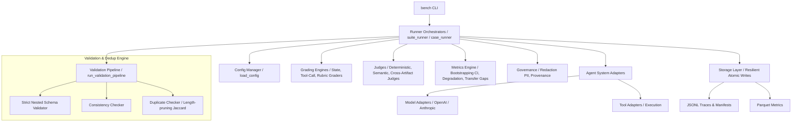

<div align="center">
  <h1>🚀 Agent-Bench</h1>
  <p><strong>Multi-domain benchmark framework for evaluating LLM agents as complete systems</strong></p>

  [](https://python.org)
  [](https://opensource.org/licenses/Apache-2.0)
  [](https://github.com/agent-bench/agent-bench/actions)
  [](https://github.com/agent-bench/agent-bench/actions)
  [](https://github.com/agent-bench/agent-bench)
  [](https://github.com/agent-bench/agent-bench)
</div>

---

## 💼 Executive Vision

Evaluating LLM-based agents requires moving beyond static, single-turn correctness checks. Enterprise agent systems operate in dynamic workflows—utilizing multi-step reasoning, invoking tools, retrieving knowledge, and conforming to strict safety guardrails.

**Agent-Bench** provides an end-to-end testing and analytics ecosystem to assess the complete agent lifecycle. It measures:
- 🎯 **Functional Correctness:** Execution correctness of multi-turn plans and state changes.
- 🛡️ **Risk & Safety Compliance:** Refusal behavior on unsafe prompts and strict avoidance of forbidden paths.
- 💰 **Operational Cost & Latency:** Total tokens consumed, financial cost, and request latency curves.
- 🔄 **Statistical Reliability:** Pass@k metrics and bootstrap confidence intervals over multiple iterations.

---

## ✨ Enterprise-Grade Core Enhancements

We have audited and upgraded Agent-Bench to satisfy strict production and clean architecture requirements:

1. **Jaccard Complexity Pruning (\(O(n)\) Average-Case):**
   The duplicate checker has been optimized using a mathematical upper-bound pruning check.
   \[
   J(A, B) = \frac{|A \cap B|}{|A \cup B|} \le \frac{\min(|A|, |B|)}{\max(|A|, |B|)}
   \]
   By skipping intersections for token sets whose length ratio falls below the threshold, we eliminate redundant comparisons, reducing pairwise matching overhead.

2. **Atomic Write Resilience (Zero-Corruption Storage):**
   File writes for trace events, manifests, per-task metrics, and Parquet data files now execute atomically. Data is written to a temporary `.tmp` file, flushed to disk, and renamed using `os.replace`. This prevents file corruption during sudden execution interrupts or power failures.

3. **Strict Nested Schema Audits:**
   The validation pipeline checks nested data shapes (such as `input_messages` roles/content, `required_tool_patterns`, `evidence_strings`, and hierarchical `rubrics` constraints) at load time, ensuring malformed datasets are blocked before entering the evaluation pipeline.

---

## 📦 Installation

Agent-Bench requires **Python 3.12+**.

```bash
# Clone the repository
git clone https://github.com/agent-bench/agent-bench.git
cd agent-bench

# Install core package along with development requirements
pip install -e ".[dev]"

# Install with model provider integrations
pip install -e ".[openai]"
pip install -e ".[anthropic]"

# Install all dependencies
pip install -e ".[all]"
```

---

## 🏗️ Project Architecture



### Directory Structure

```text
agent-bench/
  configs/              # YAML configurations (models, systems, suites, judges)
  datasets/
    gold/dev/           # Human-curated evaluation golden cases
    synthetic/shadow/   # Auto-generated shadow cases for coverage expansion
    adversarial/        # Attack vectors and boundary-testing cases
  src/agent_bench/
    cli/                # Click-based CLI commands
    core/               # Schema definitions, configuration logic, base scenarios
    validators/         # Validation, consistency, and deduplication logic
    generators/         # Synthetic case generation pipelines
    graders/            # State, tool-call, rubric, and composite grading engines
    metrics/            # C.I., precision/recall computations, compliance scoring
    models/             # Provider implementations (stub, openai, anthropic)
    tools/              # Tool execution adapters
    judges/             # Deterministic and LLM-as-a-judge evaluators
    runners/            # Suite, single-case, and online evaluation orchestrators
    reports/            # Markdown & HTML leaderboard/report generators
    storage/            # Artifact persistence (JSONL, Parquet, local DB)
    governance/         # Case versioning, data provenance, and PII redaction
    utils/              # Observability tracing, plugins, shared tools
  tests/                # Comprehensive unit, integration, and golden test suites
```

---

## 🚀 Quickstart

Agent-Bench is operated via the CLI tool `bench`:

```bash
# Validate your configuration YAMLs and dataset structures
bench --config-dir configs validate-config

# Run a suite (stub mode - no API keys needed for testing!)
bench --config-dir configs run-suite pix_basic_v1

# Run a specific evaluation case
bench --config-dir configs run-case PIX_001 --system tool_calling_reactive_gpt4 --domain pix_assist

# Generate a detailed Markdown/HTML report for a run
bench generate-report <run-id>

# Compare two evaluation runs side-by-side
bench compare-runs <run-id-1> <run-id-2>
```

---

## ⚖️ Grading & Weighting Profiles

Agent-Bench evaluates systems against customizable weighting profiles suited for specific use-cases:

| Profile | Functional | Risk | Cost | Latency | Reliability |
|---------|-----------|------|------|---------|-------------|
| **high_volume_low_risk** | 0.30 | 0.10 | 0.30 | 0.20 | 0.10 |
| **transactional_high_risk** | 0.25 | 0.40 | 0.10 | 0.10 | 0.15 |
| **advisory_regulated** | 0.30 | 0.30 | 0.10 | 0.05 | 0.25 |
| **ops_long_horizon** | 0.35 | 0.20 | 0.15 | 0.05 | 0.25 |
| **cyber_restricted** | 0.20 | 0.45 | 0.05 | 0.05 | 0.25 |

---

## 🧪 Running Tests

Ensure all components and integrations are passing locally:

```bash
# Run all tests
pytest tests/ -v

# Run specific test suites
pytest tests/unit/ -v           # Unit tests only
pytest tests/integration/ -v    # Integration tests only
```

---

## 📜 License

This project is licensed under the terms of the **Apache-2.0** License.
